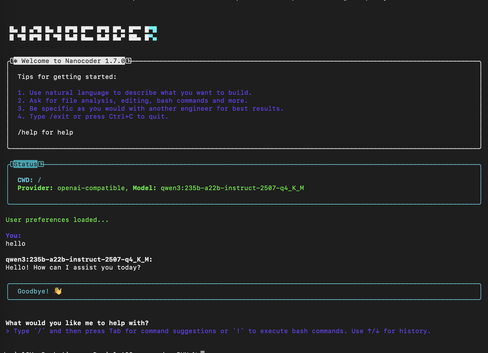
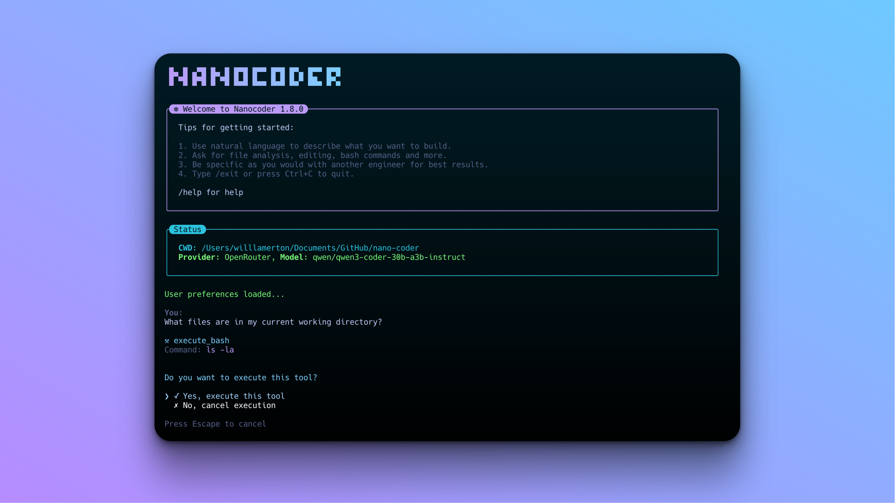

# A2S-AI (Build and Run)

```
git clone https://github.com/a2s-ai/A2S_nanocoder.git

cd A2S_nanocoder/

vi agents.config.json

daniel@MacBook A2S_nanocoder % cat agents.config.json
{
	"nanocoder": {
		"openAICompatible": {
			"baseUrl": "https://XXX-XXX-XXX-XXX",
			"apiKey": "a2s-ai",
			"models": ["qwen3:235b-a22b-instruct-2507-q4_K_M", "qwen3:235b-a22b-thinking-2507-q4_K_M"]
		}
	}
}
daniel@MacBook A2S_nanocoder %
```

```
./docker_build_and_run.sh
```



# A2S GPU Server

* 4 x NVIDIA RTX 6000A

## Ollama (Docker) Settings

```
root@ai-ubuntu24gpu-large:~# cat /opt/run-ollama-max.sh
#!/bin/sh

export HUGGING_FACE_HUB_TOKEN=hf_XXX-XXX-XXX
export CUDA_VISIBLE_DEVICES="0,1,2,3"

docker run \
       --name ollama-max \
       --network ollama-max \
       --gpus='"device=0,1,2,3"' \
       --runtime=nvidia \
       --shm-size=8g \
       -p 11434:11434 \
       --rm --init \
       -e OLLAMA_HOME=/ollama-data \
       -v /data/opt/ollama:/ollama-data \
       -v /data/opt/ollama:/root/.ollama \
       -e OLLAMA_KEEP_ALIVE=-1 \
       -e OLLAMA_MAX_LOADED_MODELS=1 \
       -e OLLAMA_NUM_PARALLEL=4 \
       -e OLLAMA_MAX_QUEUE=512 \
       -e OLLAMA_ORIGINS="*" \
       -e OLLAMA_DEBUG=0 \
       -e OLLAMA_NUM_GPU_LAYERS=9999 \
       -e OLLAMA_DISABLE_CPU=1 \
       -e OLLAMA_LOAD_TIMEOUT=600 \
       ollama/ollama:latest

# EOF
root@ai-ubuntu24gpu-large:~#
```

# Nanocoder

A local-first CLI coding agent that brings the power of agentic coding tools like Claude Code and Gemini CLI to local models or controlled APIs like OpenRouter. Built with privacy and control in mind, Nanocoder supports multiple AI providers with tool support for file operations and command execution.



## Table of Contents

- [Installation](#installation)
  - [For Users (Recommended)](#for-users-recommended)
  - [For Development](#for-development)
- [Configuration](#configuration)
  - [AI Provider Setup](#ai-provider-setup)
  - [MCP (Model Context Protocol) Servers](#mcp-model-context-protocol-servers)
  - [User Preferences](#user-preferences)
  - [Commands](#commands)
    - [Built-in Commands](#built-in-commands)
    - [Custom Commands](#custom-commands)
- [Features](#features)
  - [Multi-Provider Support](#-multi-provider-support)
  - [Advanced Tool System](#️-advanced-tool-system)
  - [Custom Command System](#-custom-command-system)
  - [Enhanced User Experience](#-enhanced-user-experience)
  - [Developer Features](#️-developer-features)
- [Community](#community)

## Installation

### For Users (Recommended)

Install globally and use anywhere:

```bash
npm install -g @motesoftware/nanocoder
```

Then run in any directory:

```bash
nanocoder
```

### For Development

If you want to contribute or modify Nanocoder:

**Prerequisites:**

- Node.js 18+
- npm

**Setup:**

1. Clone and install dependencies:

```bash
git clone [repo-url]
cd nanocoder
npm install
```

2. Build the project:

```bash
npm run build
```

3. Run locally:

```bash
npm run start
```

Or build and run in one command:

```bash
npm run dev
```

## Configuration

### AI Provider Setup

**Option A: Ollama (Local AI)**

```bash
ollama pull qwen2.5-coder:14b  # or any other model
```

**Option B: OpenRouter (Cloud AI)**

Create `agents.config.json` in your **working directory** (where you run `nanocoder`):

```json
{
	"nanocoder": {
		"openRouter": {
			"apiKey": "your-api-key-here",
			"models": ["foo-model", "bar-model"]
		}
	}
}
```

**Option C: llama.cpp (Local Inference)**

Configure llama.cpp server for local model inference:

```json
{
	"nanocoder": {
		"llamaCpp": {
			"baseUrl": "http://localhost:8080",
			"apiKey": "optional-api-key",
			"models": ["your-model"],
			"timeout": 30000,
			"maxRetries": 3
		}
	}
}
```

To set up llama.cpp server:

1. Install llama.cpp: Follow the [official installation guide](https://github.com/ggerganov/llama.cpp)
2. Download a GGUF model (e.g., from Hugging Face)
3. Start the server: `./llama-server -m your-model.gguf -c 4096 --host 0.0.0.0 --port 8080`

**Option D: OpenAI-Compatible APIs (Local or Remote)**

Configure any OpenAI-compatible API endpoint (e.g., LM Studio, Ollama Web API, vLLM, LocalAI, etc.):

```json
{
	"nanocoder": {
		"openAICompatible": {
			"baseUrl": "http://localhost:1234",
			"apiKey": "optional-api-key",
			"models": ["model-1", "model-2"]
		}
	}
}
```

Common OpenAI-compatible providers:

- **LM Studio**: `"baseUrl": "http://localhost:1234"`
- **Ollama Web API**: `"baseUrl": "http://localhost:11434"`
- **vLLM**: `"baseUrl": "http://localhost:8000"`
- **LocalAI**: `"baseUrl": "http://localhost:8080"`
- **Any OpenAI-compatible endpoint**: Just provide the base URL

### MCP (Model Context Protocol) Servers

Nanocoder supports connecting to MCP servers to extend its capabilities with additional tools. Configure MCP servers in your `agents.config.json`:

```json
{
	"nanocoder": {
		"mcpServers": [
			{
				"name": "filesystem",
				"command": "npx",
				"args": [
					"@modelcontextprotocol/server-filesystem",
					"/path/to/allowed/directory"
				]
			},
			{
				"name": "github",
				"command": "npx",
				"args": ["@modelcontextprotocol/server-github"],
				"env": {
					"GITHUB_TOKEN": "your-github-token"
				}
			},
			{
				"name": "custom-server",
				"command": "python",
				"args": ["path/to/server.py"],
				"env": {
					"API_KEY": "your-api-key"
				}
			}
		]
	}
}
```

When MCP servers are configured, Nanocoder will:

- Automatically connect to all configured servers on startup
- Make all server tools available to the AI model
- Show connected servers and their tools with the `/mcp` command

Popular MCP servers:

- **Filesystem**: Enhanced file operations
- **GitHub**: Repository management
- **Brave Search**: Web search capabilities
- **Memory**: Persistent context storage
- [View more MCP servers](https://github.com/modelcontextprotocol/servers)

> **Note**: The `agents.config.json` file should be placed in the directory where you run Nanocoder, allowing for project-by-project configuration with different models or API keys per repository.

### User Preferences

Nanocoder automatically saves your preferences to remember your choices across sessions. Preferences are stored in `~/.nanocoder-preferences.json` in your home directory.

**What gets saved automatically:**

- **Last provider used**: The AI provider you last selected (Ollama, OpenRouter, or OpenAI-compatible)
- **Last model per provider**: Your preferred model for each provider
- **Session continuity**: Automatically switches back to your preferred provider/model when restarting

**How it works:**

- When you switch providers with `/provider`, your choice is saved
- When you switch models with `/model`, the selection is saved for that specific provider
- Next time you start Nanocoder, it will use your last provider and model
- Each provider remembers its own preferred model independently

**Manual management:**

- View current preferences: The file is human-readable JSON
- Reset preferences: Delete `~/.nanocoder-preferences.json` to start fresh
- No manual editing needed: Use the `/provider` and `/model` commands instead

### Commands

#### Built-in Commands

- `/help` - Show available commands
- `/clear` - Clear chat history
- `/model` - Switch between available models
- `/provider` - Switch between AI providers (ollama/openrouter/openai-compatible)
- `/mcp` - Show connected MCP servers and their tools
- `/debug` - Toggle logging levels (silent/normal/verbose)
- `/custom-commands` - List all custom commands
- `/exit` - Exit the application
- `!command` - Execute bash commands directly without leaving Nanocoder (output becomes context for the LLM)

#### Custom Commands

Nanocoder supports custom commands defined as markdown files in the `.nanocoder/commands` directory. Like `agents.config.json`, this directory is created per codebase, allowing you to create reusable prompts with parameters and organize them by category specific to each project.

**Example custom command** (`.nanocoder/commands/test.md`):

```markdown
---
description: 'Generate comprehensive unit tests for the specified component'
aliases: ['testing', 'spec']
parameters:
  - name: 'component'
    description: 'The component or function to test'
    required: true
---

Generate comprehensive unit tests for {{component}}. Include:

- Happy path scenarios
- Edge cases and error handling
- Mock dependencies where appropriate
- Clear test descriptions
```

**Usage**: `/test component="UserService"`

**Features**:

- YAML frontmatter for metadata (description, aliases, parameters)
- Template variable substitution with `{{parameter}}` syntax
- Namespace support through directories (e.g., `/refactor:dry`)
- Autocomplete integration for command discovery
- Parameter validation and prompting

**Pre-installed Commands**:

- `/test` - Generate comprehensive unit tests for components
- `/review` - Perform thorough code reviews with suggestions
- `/refactor:dry` - Apply DRY (Don't Repeat Yourself) principle
- `/refactor:solid` - Apply SOLID design principles

## Features

### 🔌 Multi-Provider Support

- **Ollama**: Local inference with privacy and no API costs
- **OpenRouter**: Access to premium models (Claude, GPT-4, etc.)
- **llama.cpp**: Direct local inference with GGUF models and optimized performance
- **OpenAI-Compatible APIs**: Support for LM Studio, vLLM, LocalAI, and any OpenAI-spec API
- **Smart fallback**: Automatically switches to available providers if one fails
- **Per-provider preferences**: Remembers your preferred model for each provider

### 🛠️ Advanced Tool System

- **Built-in tools**: File operations, bash command execution
- **MCP (Model Context Protocol) servers**: Extend capabilities with any MCP-compatible tool
- **Dynamic tool loading**: Tools are loaded on-demand from configured MCP servers
- **Tool approval**: Optional confirmation before executing potentially destructive operations

### 📝 Custom Command System

- **Markdown-based commands**: Define reusable prompts in `.nanocoder/commands/`
- **Template variables**: Use `{{parameter}}` syntax for dynamic content
- **Namespace organization**: Organize commands in folders (e.g., `refactor/dry.md`)
- **Autocomplete support**: Tab completion for command discovery
- **Rich metadata**: YAML frontmatter for descriptions, aliases, and parameters

### 🎯 Enhanced User Experience

- **Smart autocomplete**: Tab completion for commands with real-time suggestions
- **Prompt history**: Access and reuse previous prompts with `/history`
- **Configurable logging**: Silent, normal, or verbose output levels
- **Colorized output**: Syntax highlighting and structured display
- **Session persistence**: Maintains context and preferences across sessions
- **Real-time indicators**: Shows token usage, timing, and processing status

### ⚙️ Developer Features

- **TypeScript-first**: Full type safety and IntelliSense support
- **Extensible architecture**: Plugin-style system for adding new capabilities
- **Project-specific config**: Different settings per project via `agents.config.json`
- **Debug tools**: Built-in debugging commands and verbose logging
- **Error resilience**: Graceful handling of provider failures and network issues

## Community

We're a small team building Nanocoder and would love your help! Whether you're interested in contributing code, documentation, or just being part of our community, there are several ways to get involved.

**If you want to contribute:**

- Read our detailed [CONTRIBUTING.md](CONTRIBUTING.md) guide for information on development setup, coding standards, and how to submit your changes.

**If you want to be part of our community:**

- Join our Discord server to connect with other users, ask questions, share ideas, and get help: [Join our Discord server](https://discord.gg/ktPDV6rekE)

Whether you're interested in:

- Adding support for new AI providers
- Improving tool functionality
- Enhancing the user experience
- Writing documentation
- Reporting bugs or suggesting features
- Just learning about local-first AI coding tools

All contributions and community participation are welcome!
